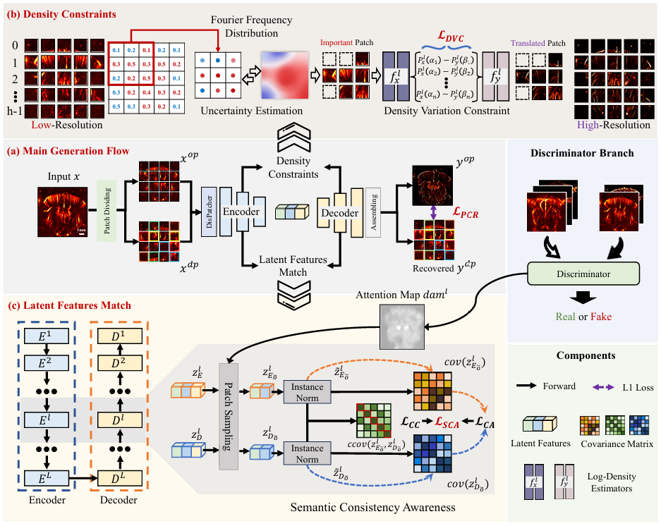

# [MedIA 2026] Ultrasound Localization Microscopy Learned From Power Doppler by Uncertainty Frequency Density Estimation and Semantic Consistency Awareness 

## :rocket: Overview

Here's a framework overview of our **PDSR** method:

<p align="center">
  
</p>


## 🛠️ Prepare your own dataset

To get started with PDSR, follow the instructions below.

1. Enter the data directory

```
cd ./PDSR_for_Training/datasets
```

2. Organize the data in the following format
```
Your Dataset/
├── trainA/
│ ├── xxx.png
│ ├── xxx.png
│ └── ...
├── trainB/
│ ├── xxx.png
│ └── ...
├── testA/
│ ├── xxx.png
│ └── ...
└── testB/
├── xxx.png
└── ...
```

### :blue_book: Example Usage

1. Training
```
cd ./PDSR_for_Training
```

```sh
CUDA_VISIBLE_DEVICES=0 python3 train.py --dataroot datasets/dataset'name
```

2. Testing

```
cd ./PDSR_for_Inferencing
```

Place the trained checkpoints in the current directory

```sh
CUDA_VISIBLE_DEVICES=0 python3 test.py --dataroot datasets/dataset'name
```

# Datasets

The test cases in PDSR can be obtained at the following link:

[Baidu Cloud](https://pan.baidu.com/s/1UnBEJ6IlojNqJHA2XVdNVw )            Password: 4c4f

[Google Cloud](https://drive.google.com/file/d/1wZDU2vc1SuSisKimzROM_xh-nxHwI8aY/view)
